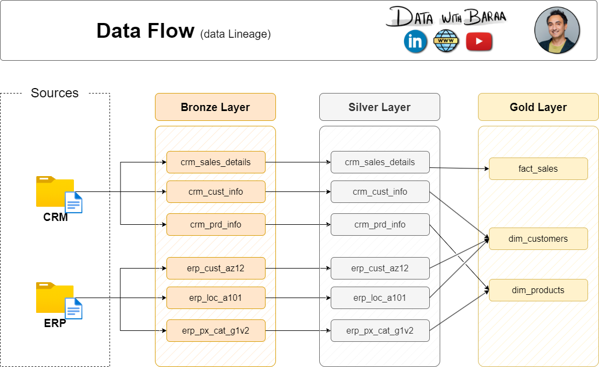
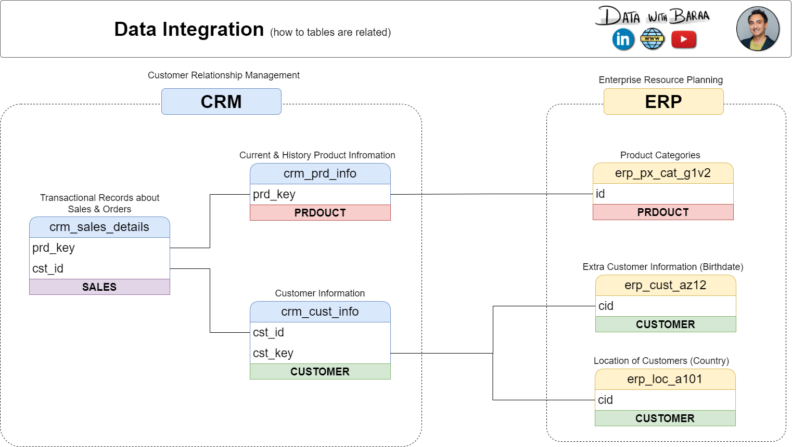
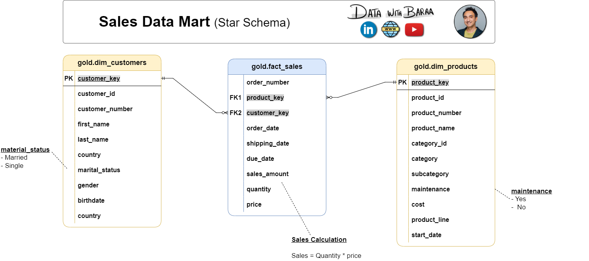
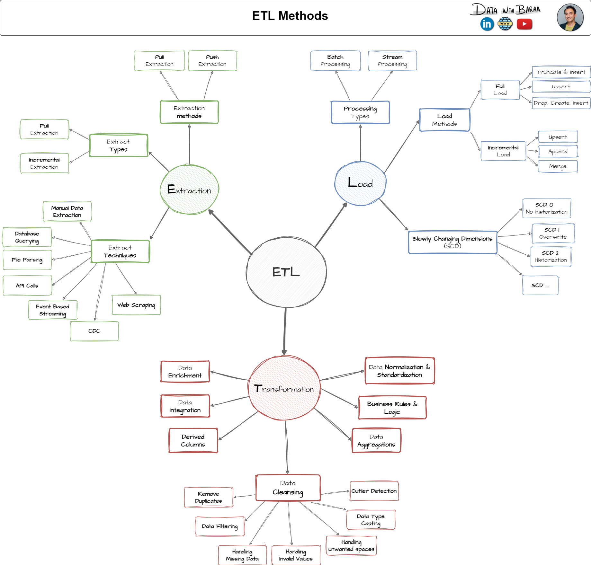

# Data Warehouse Project – Bronze, Silver, Gold Architecture

## Overview

This project is an end-to-end implementation of a data warehouse using the layered **Bronze-Silver-Gold architecture**, designed independently after learning the methodology from **Data with Baraa**, a YouTube educator and Lead Data Analyst at Mercedes-Benz. The warehouse processes data from CRM and ERP systems, applies ETL principles, and models the data using a **Star Schema** for business reporting and analytics.

While the conceptual guidance was inspired by the YouTube series, all implementations including SQL scripts, transformations, modeling, and ER diagrams were done independently using industry-standard naming conventions and structures.

---

## Architecture and Flow

### High-Level Architecture


### Data Flow (Lineage)



### Entity Relationship and Integration



### Star Schema – Sales Data Mart



---

## Source Systems

* **CRM System**: Contains customer profiles, product information, and sales data.
* **ERP System**: Contains extended customer info, location, and product category details.
* **File Type**: CSV
* **Interface**: Local flat files (simulating enterprise input formats)

---

## Layers Used

### Bronze Layer (Raw)

* **Object Type**: Tables
* **Load**: Batch processing using full load with truncate and insert
* **Transformations**: None (raw as-is data)
* **Purpose**: Initial landing zone for all source data

### Silver Layer (Cleaned)

* **Object Type**: Tables
* **Transformations**:

  * Data cleansing
  * Normalization
  * Derived columns
  * Enrichment
* **Load**: Same strategy as Bronze
* **Purpose**: Cleaned, validated data for building business logic

### Gold Layer (Business-Ready)

* **Object Type**: Views
* **Transformations**:

  * Aggregations
  * Data integrations
  * Business logic
* **Modeling**: Star Schema (fact\_sales, dim\_customers, dim\_products)
* **Purpose**: Ready for consumption by BI tools and analysts

---

## ETL Strategy



* **Extraction**: CSV files from source systems
* **Load Type**: Full load using truncate-insert approach
* **Processing**: Batch (simulated)
* **Transformation**: Executed in stored procedures at Silver and Gold layers
* **SCD Type**: No historization (SCD Type 0)

---

## Technologies Used

* **SQL Server Management Studio (SSMS)**
* **T-SQL (Transact-SQL)**
* **Flat file ingestion using BULK INSERT**
* **Data modeling: Star Schema**
* **ER Diagram tools**: Drawn manually based on schema design

---

## How to Run

1. Import CRM and ERP CSV files into the Bronze Layer tables.
2. Run the stored procedures to move and transform data from Bronze to Silver Layer.
3. Run the stored procedures to transform Silver Layer data into business-ready views in the Gold Layer.
4. Query views in the Gold Layer (e.g., `gold.fact_sales`, `gold.dim_customers`) for reporting and analysis.

---

## Project Structure

```
/sql-data-warehouse-project
|
├── Images/
│   ├── data_architecture.png
│   ├── data_flow.png
│   ├── data_integration.png
│   ├── data_model.png
│   └── ETL.png
|
├── datasets/
│   ├── crm_data.csv
│   └── erp_data.csv
|
├── scripts/
│   ├── create_bronze_tables.sql
│   ├── load_bronze_data.sql
│   ├── silver_layer_transforms.sql
│   ├── gold_layer_views.sql
│   └── stored_procedures.sql
|
├── tests/
├── LICENSE
└── README.md
```

---

## Reflections

This project helped me understand how real-world data warehouses are architected and implemented. I learned the value of layering, clean data pipelines, and aligning transformations with business needs. Although I followed the concepts from a tutorial, all work—scripts, structure, modeling—was done independently to simulate how warehouses are handled in production environments.

---

## Credits

Conceptual learning source: [Data with Baraa – YouTube](https://www.youtube.com/@DataWithBaraa)

Naming conventions and design approach follow industry practices shared by the creator but adapted and implemented independently for learning and portfolio purposes.
